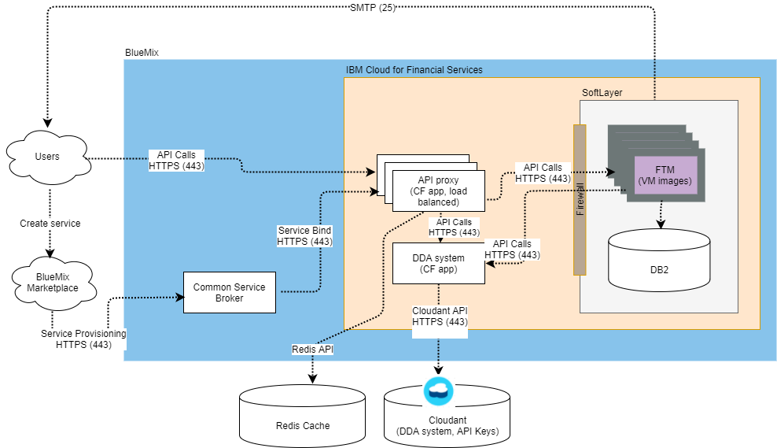

# Real Time Payments with Financial Transaction Manager

In this developer journey, we will use a Bluemix finance service to create a web application which sends and requests payments. The FTM for Real Time Payments service is used to manage tokens and recipients, and to initiate payments and payment requests.

When the reader has completed this journey, they will understand how to:

* Manage Participants, Tokens and Recipients
* Initiate Payments and PaymentRequests
* View transaction activity

<p align="center">
  
</p>

## Included Components
+ Bluemix FTM for Real Time Payments

# Deploy to Bluemix

[](https://bluemix.net/devops/setup/deploy?repository=https://b6df0a8fbd689cdde5a4e6776e215d7e04892bc6@github.ibm.com/mhudson/ftm4zelle)

# Running the Application
Follow these steps to setup and run this developer journey. The steps are described in detail below.

## Prerequisite
- [node.js](https://nodejs.org/)
- [npm](https://www.npmjs.com/)

## Steps
1. [Clone the repo](#1-clone-the-repo)
2. [Create Bluemix services](#2-create-bluemix-services)
3. [Run Application](#3-run-application)

## 1. Clone the repo

Clone the `FTM for Real Time Payments code` locally. In a terminal, run:

  `$ git clone https://b6df0a8fbd689cdde5a4e6776e215d7e04892bc6@github.ibm.com/mhudson/ftm4zelle.git`


## 2. Create Bluemix services

Create the following services:

* [**FTM for Real Time Payments**](https://console.ng.bluemix.net/catalog/services/ftm4zelle)


## 3. Run Application

cd into this project's root directory
+ Run `npm install` to install the app's dependencies
+ Run `runme.sh`
+ Access the running app in a browser at <http://0.0.0.0:8080/>

# Developer Journey

The application emulates a bank's online. Using your favorite browser, launch the application and choose "i'm new here". Enter a first name, last name, user name and any password. 

If the specified user name exists, the user will be redirected to the standard login process. Otherwise the application will create two new accounts, checking and savings, by calling the 'core banking system' database, and put some money in each account. The application will also create a Participant by calling FTM's CXCParticipant (POST) API.

Assume John Doe is a customer of the bank. 

The application displays a list of John's accounts - checking and savings - and the balance of each. This information is retrieved from the 'core banking system' database.

The application has an option to "send or receive money".

### In use case #1, John selects "Add/Edit Your Email/Mobile #". 

A list of John's tokens is displayed. This information is pulled from FTM’s CXCToken API (GET). 
Clicking on one of them allows John to view/edit the 'contact info', and select from a list of his accounts (pulled from the 'core banking system' database). A legal disclaimer is displayed with a checkbox to indicate acceptance. Clicking Continue produces a confirmation page and then clicking "Add email/mobile #" invokes FTM's CXCToken API (POST). John can also “Edit” the token using FTM's CXCToken API (PUT), or "Delete" the token, and after the "are you sure ?" check, FTM's CXCToken API (DELETE) is invoked.

John may "Add another email/mobile #". The 'contact info' field is free text, the 'deposit account' is a list of his accounts (pulled from the 'core banking system' database). A legal disclaimer is displayed with a checkbox to indicate acceptance. Clicking Continue produces a confirmation page and then clicking "Add email/mobile #" invokes FTM's CXCToken API (POST).

Next John selects "Add Recipients".

A list of John's recipients is displayed. This information is pulled from FTM’s CXCRecipient API (GET). 
Clicking on one of them allows John to view/edit the 'recipient details'. Details are pulled from FTM’s CXCRecipient  API (GET). John may "Add New Recipient". The "Mobile # or Email", "First Name", and "Last Name" fields are free text. Clicking Continue produces a confirmation page and then clicking "Add recipient" invokes FTM's CXCRecipient API (POST).  John can also can also “Edit” the recipient using FTM's CXCRecipient API (PUT), or "Delete" the recipient, and after the "are you sure ?" check, FTM's CXCRecipient API (DELETE) is invoked.

### In use case #2. John chooses "Send".

He can either choose a recipient from a list, pulled from FTM's CXCRecipient API (GET), or enter an email/mobile # manually. The next screen prompts him for the amount (in $USD), and a list of his source accounts, pulled from FTM's CXCToken API (GET). Clicking 'continue' gives a confirmation screen and then clicking "Send" invokes FTM's CXCPayment API (POST). FTM debits the selected amount from John's account by calling back into the 'core banking system' database. FTM notifies the recipient via email (or sms) by calling a User Exit.

### In use case #3. John chooses "Request".

He can either choose a recipient from a list, pulled from FTM's CXCRecipient API (GET), or enter an email/mobile # manually. The next screen prompts him for the amount (in $USD), and a list of his deposit accounts, pulled from FTM's CXCToken API (GET). Clicking 'continue' gives a confirmation screen and then clicking "Request" invokes FTM's CXCPaymentRequest API (POST). FTM notifies the requestee via email (or sms) by calling a User Exit.

John can then choose "View Activity".

A list of statii is given (Accepted, Completed, Delivered, Expired, Failed, Pending, Sent). Each of those can be chosen, and a list of payments in that status is given, pulled from CXCPayment and CXCPaymentRequest APIs (GET). Each selected transaction can be viewed, the data is pulled from the CXCPayment or CXCPaymentRequest API (GET). 

John logs out of the application.

### In use case #4. Billy Fish is a developer who works at the bank. He is building a portal for bank operators to monitor the operations of the payments hub.

Using a web browser, he logs onto the BlueMix Console and navigates to the FTM for Real Time Payments APIs. His user name, password and API Key are verified by the API Proxy which maintains a secret username and password to use with FTM’s REST API.

He can explore FTM’s core read-only APIs and he chooses to view inboundTransactions (GET). 

Find more information on FTM for Real Time Payments api calls [here](https://console.ng.bluemix.net/apidocs/000-ftm4zelle?&language=node#introduction).

Billy logs out of BlueMix.


# Troubleshooting

* To troubleshoot your Bluemix application, use the logs. To see the logs, run:

```bash
cf logs <application-name> --recent
```

# License

[Apache 2.0](LICENSE)