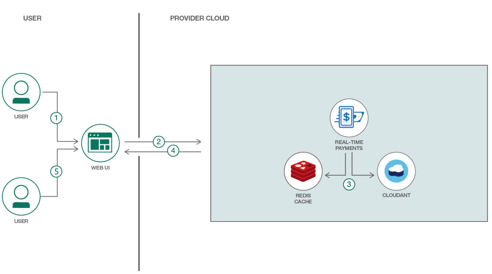
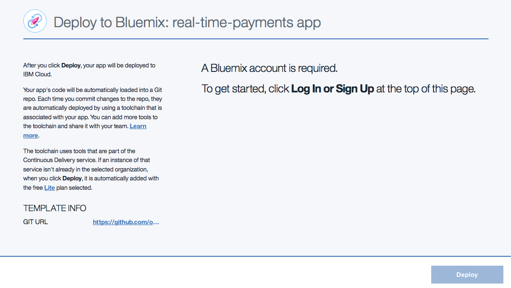
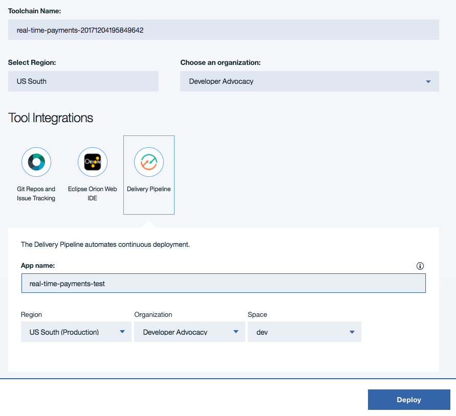
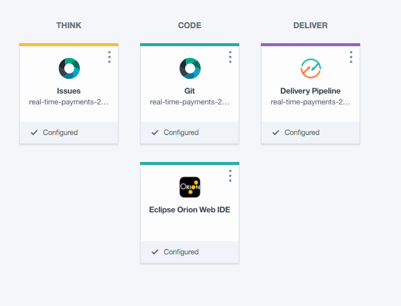
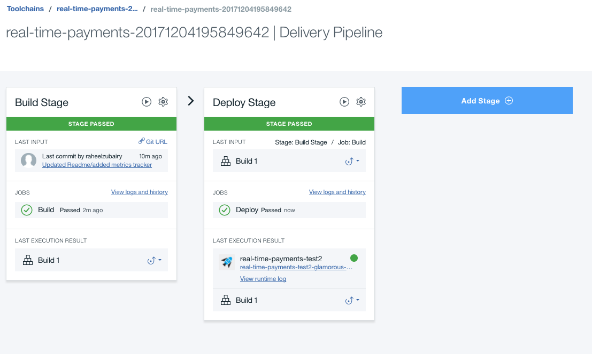

# OBSOLETE: This code pattern is obsolete

> The 3rd party zelle Real Time Payments service is not operational at the moment. This repository will not be updated. We will keep the repository available for folks interested in some of the technical details. 


*Read this in other languages: [日本語](README-ja.md).*

# Real-Time Payments

In this code pattern, we will use a Bluemix finance service to create a web application which sends and requests payments. The Real-Time Payments service is used to manage tokens and recipients, and to initiate payments and payment requests.

The application presents an online banking experience, starting with getting a user to create an account. A user's sample bank account is created with a checking and savings account.  In order for user to start making payments, the user is requested to register an email or phone number as their token for their checking or savings account. After completing this step, the user can send or request payments to another user's account using their token such as phone number or email. All user activities are recorded and can be displayed to the user.

When the reader has completed this code pattern, they will understand how to:

* Manage Participants, Tokens and Recipients
* Initiate Payments and PaymentRequests
* View transaction activity

# Architecture

<p align="center">
  
</p>


1. User A logs into the Demo banking portal and can link email addresses and/or phone numbers to their account, add recipients identified by their email addresses or phone numbers, and can send or request money to the recipients added by the user such as User B.
2. All these actions are controlled through API calls by the application using the Real-time Payments service.
3.  The service uses Redis Cache and a Cloudant DDA system to store data, process request and provide security.
4. Once the transactions are registered and completed, they can be viewed through the banking portal.
5.  User B can log in and see the money sent or request made by User A.


## Included Components

+ [**Real-Time Payments**](https://console.ng.bluemix.net/catalog/services/real-time-payments-service)

## Featured Technology

+ [**Real-Time Payments API**](https://console.bluemix.net/apidocs/1152)

# Deploy to IBM Cloud

[](https://bluemix.net/deploy?repository=https://github.com/IBM/real-time-payments)

1. Log in to your IBM Cloud account before deploying. If already logged in, then ignore this step.


2. We can see that the app is ready to be deployed. Provide an `App name` to your application and ensure that the Region, Organization and Space is valid before pressing 'Deploy'.


3. In Toolchain, the app is deployed. There are also options to edit code via eclipseIDE, git changes if required.


4. You should see two stages pass successfully once your **Deploy Stage** completes


5. To see the app and services created and configured for this pattern, use the IBM Cloud dashboard

# Run the Application Locally
Follow these steps to setup and run this code pattern. The steps are described in detail below.

## Prerequisite
- [node.js](https://nodejs.org/)
- [npm](https://www.npmjs.com/)

## Steps
1. [Clone the repo](#1-clone-the-repo)
2. [Create Bluemix services](#2-create-bluemix-services)
3. [Configure Manifest](#3-configure-manifest)
4. [Configure .env file](#4-configure-env-file)
5. [Run the application](#5-run-application)

## 1. Clone the repo

Clone the `Real Time Payments` locally. In a terminal, run:

  `$ git clone https://github.com/IBM/real-time-payments.git`


## 2. Create Bluemix services

Create the following services:

* [**Real-Time Payments**](https://console.ng.bluemix.net/catalog/services/real-time-payments-service)


## 3. Configure Manifest
Edit the `manifest.yml` file in the folder that contains your code and replace `my-real-time-payments-app` with a unique name for your application.  Additional - update the service name so they match what you have in IBM Cloud. The relevant portion of the `manifest.yml` file looks like the following:

```
declared-services:
    {Real-Time-Payments}:
      label: real-time-payments-service
      plan: real-time-payments-service-free-plan
applications:
- name: {my-real-time-payments-app}
  random-route: true
  memory: 128M
  services:
    - {Real-Time-Payments}
  env:
    NODE_TLS_REJECT_UNAUTHORIZED: 0
```

## 4. Configure .env file

Create a `.env` file in the root directory of your clone of the project repository by copying the sample `.env.example` file using the following command:

**NOTE** Most files systems regard files with a "." at the front as hidden files.  If you are on a Windows system, you should be able to use either [GitBash](https://git-for-windows.github.io/) or [Xcopy](https://www.microsoft.com/resources/documentation/windows/xp/all/proddocs/en-us/xcopy.mspx?mfr=true)


```
cp .env.example .env
```

You will need to update the credentials with Real-time payments service access token:

```
# Real-time Payments
CRED_REAL_TIME_PAYMENTS_URL=https://ftm-proxy.mybluemix.net
CRED_SIMULATED_INSTRUMENT_ANALYTICS_ACCESSTOKEN=
```


## 5. Run the application

cd into this project's root directory
+ Run `npm install` to install the app's dependencies
+ Run `runme.sh`
+ Access the running app in a browser at <http://0.0.0.0:8080/>

# Using the Application

The application emulates a bank's online web or mobile portal. Using your favorite browser, launch the application and choose "i'm new here". Enter a first name, last name, user name and any password.

If the specified user name exists, the user will be redirected to the standard login process. Otherwise the application will create two new accounts, checking and savings, by calling the 'core banking system' database, and put some money in each account. The application will also create a Participant by calling FTM's CXCParticipant (POST) API.

Assume John Doe is a customer of the bank.

The application displays a list of John's accounts - checking and savings - and the balance of each. This information is retrieved from the 'core banking system' database.

The application has an option to "send or receive money".

### In use case #1, John selects "Add/Edit Your Email/Mobile #".

A list of John's tokens is displayed. This information is pulled from FTM’s CXCToken API (GET).
Clicking on one of them allows John to view/edit the 'contact info', and select from a list of his accounts (pulled from the 'core banking system' database). A legal disclaimer is displayed with a checkbox to indicate acceptance. Clicking Continue produces a confirmation page and then clicking "Add email/mobile #" invokes FTM's CXCToken API (POST). John can also “Edit” the token using FTM's CXCToken API (PUT), or "Delete" the token, and after the "are you sure ?" check, FTM's CXCToken API (DELETE) is invoked.

John may "Add another email/mobile #". The 'contact info' field is free text, the 'deposit account' is a list of his accounts (pulled from the 'core banking system' database). A legal disclaimer is displayed with a checkbox to indicate acceptance. Clicking Continue produces a confirmation page and then clicking "Add email/mobile #" invokes FTM's CXCToken API (POST).

Next John selects "Add Recipients".

A list of John's recipients is displayed. This information is pulled from FTM’s CXCRecipient API (GET).
Clicking on one of them allows John to view/edit the 'recipient details'. Details are pulled from FTM’s CXCRecipient  API (GET). John may "Add New Recipient". The "Mobile # or Email", "First Name", and "Last Name" fields are free text. Clicking Continue produces a confirmation page and then clicking "Add recipient" invokes FTM's CXCRecipient API (POST).  John can also can also “Edit” the recipient using FTM's CXCRecipient API (PUT), or "Delete" the recipient, and after the "are you sure ?" check, FTM's CXCRecipient API (DELETE) is invoked.

### In use case #2. John chooses "Send".

He can either choose a recipient from a list, pulled from FTM's CXCRecipient API (GET), or enter an email/mobile # manually. The next screen prompts him for the amount (in $USD), and a list of his source accounts, pulled from FTM's CXCToken API (GET). Clicking 'continue' gives a confirmation screen and then clicking "Send" invokes FTM's CXCPayment API (POST). FTM debits the selected amount from John's account by calling back into the 'core banking system' database. FTM notifies the recipient via email (or sms) by calling a User Exit.

### In use case #3. John chooses "Request".

He can either choose a recipient from a list, pulled from FTM's CXCRecipient API (GET), or enter an email/mobile # manually. The next screen prompts him for the amount (in $USD), and a list of his deposit accounts, pulled from FTM's CXCToken API (GET). Clicking 'continue' gives a confirmation screen and then clicking "Request" invokes FTM's CXCPaymentRequest API (POST). FTM notifies the requestee via email (or sms) by calling a User Exit.

John can then choose "View Activity".

A list of statii is given (Accepted, Completed, Delivered, Expired, Failed, Pending, Sent). Each of those can be chosen, and a list of payments in that status is given, pulled from CXCPayment and CXCPaymentRequest APIs (GET). Each selected transaction can be viewed, the data is pulled from the CXCPayment or CXCPaymentRequest API (GET).

John logs out of the application.

### In use case #4. Billy Fish is a developer who works at the bank. He is building a portal for bank operators to monitor the operations of the payments hub.

Using a web browser, he logs onto the BlueMix Console and navigates to the FTM for Real Time Payments APIs. His user name, password and API Key are verified by the API Proxy which maintains a secret username and password to use with FTM’s REST API.

He can explore FTM’s core read-only APIs and he chooses to view inboundTransactions (GET).

Find more information on FTM for Real Time Payments api calls [here](https://console.bluemix.net/apidocs/1152).

Billy logs out of BlueMix.


# Troubleshooting

* To troubleshoot your Bluemix application, use the logs. To see the logs, run:

```bash
cf logs <application-name> --recent
```


# License

This code pattern is licensed under the Apache Software License, Version 2.  Separate third party code objects invoked within this code pattern are licensed by their respective providers pursuant to their own separate licenses. Contributions are subject to the [Developer Certificate of Origin, Version 1.1 (DCO)](https://developercertificate.org/) and the [Apache Software License, Version 2](http://www.apache.org/licenses/LICENSE-2.0.txt).

[Apache Software License (ASL) FAQ](http://www.apache.org/foundation/license-faq.html#WhatDoesItMEAN)
